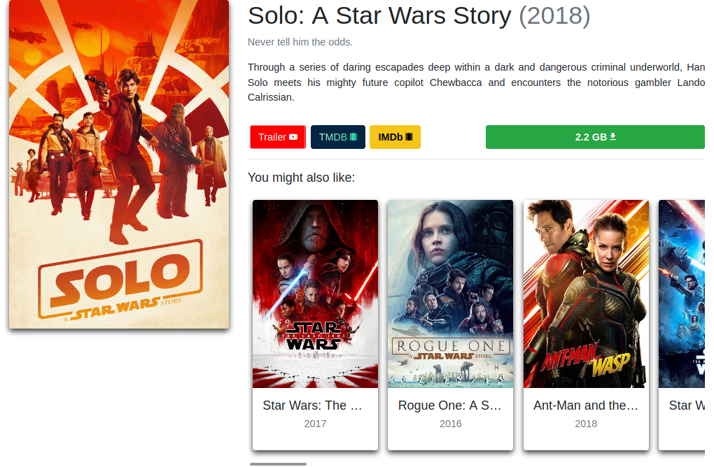
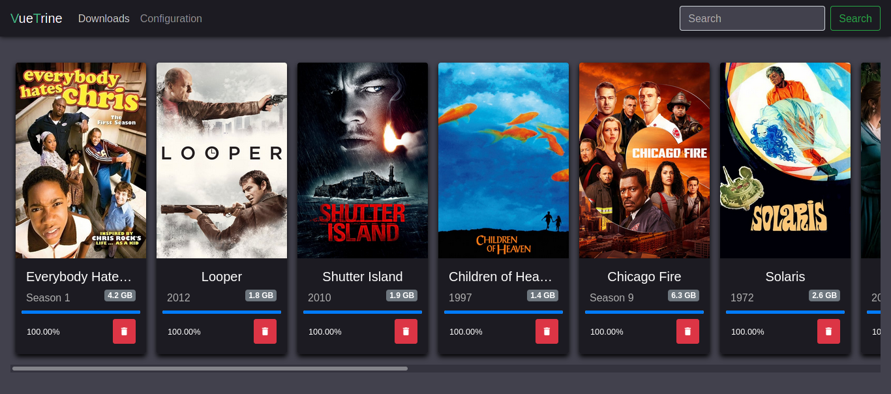

# vuetrine

Download movies and TV shows through the browser

---

VueTrine is a software that runs 100% on your browser, and allows you to cross-reference data from torrent trackers with TheMovieDB, providing a beautiful interface to browse a catalog of media.

You only need to have a [TMDB API key](https://www.themoviedb.org/settings/api).

